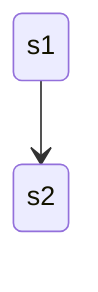
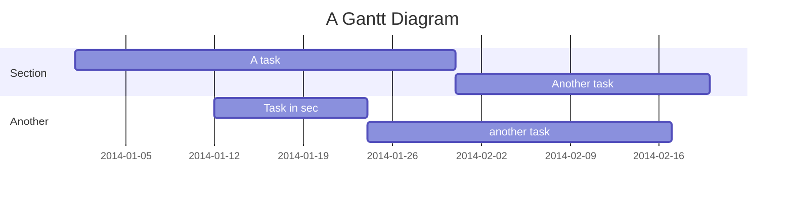

# READMEVault

Hello World

click for details

## Gantt

| Group :x: | Group :small_red_triangle_down: | Group :large_orange_diamond: | Group :large_blue_circle: |
| ----------- | ----------- | ----------- | ----------- |
| Header      | Title       | Title       | Title       |
| Paragraph   | Text        | Text        | Text        |
| Paragraph   | Text        | Text        | Text        |
| Paragraph   | Text        | Text        | Text        |

