# Start

## Soulstone 

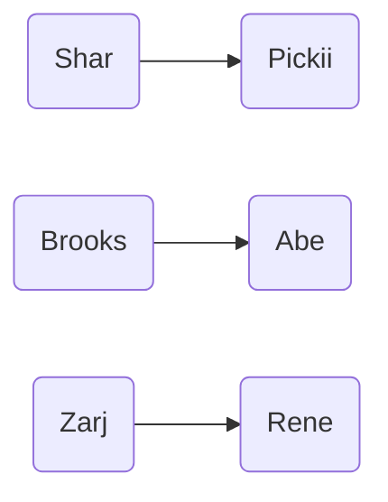

# Kalecgos

| Group | Hero |
| ----------- | ----------- |
| [G2] Hunter | Hero in Demon Realm |
| [G3] Warlock | Hero in Demon Realm |
| [G4] Mage | Hero in Demon Realm |

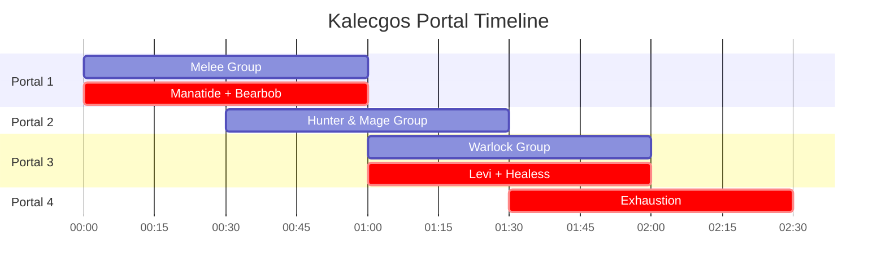

:fire: Attention :fire:
- After 1st full portal rotation, wait for Blair's callout before further pushing the dragon
- Hybrid classes help with raid healing

Click for healer assignment details

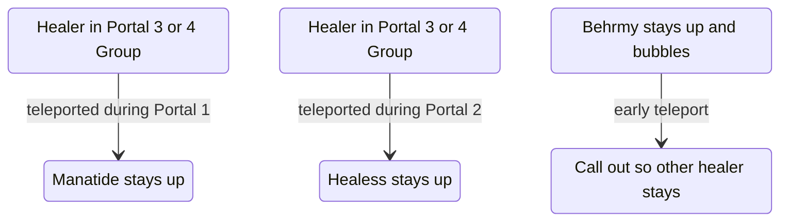

 
 

 
 

# Brutallus

| Group | Hero |
| ----------- | ----------- |
| [G1] Melee | Hero when Shar calls out |
| [G2] Hunter | Manatide Hero when Shar calls out |
| [G3] Warlock | Exhaustion Hero when Shar calls out |
| [G2] Hunter | Hero off Cooldown |
| [G3] Warlock | Hero off Cooldown |
| [G4] Mage | Hero off Cooldown |

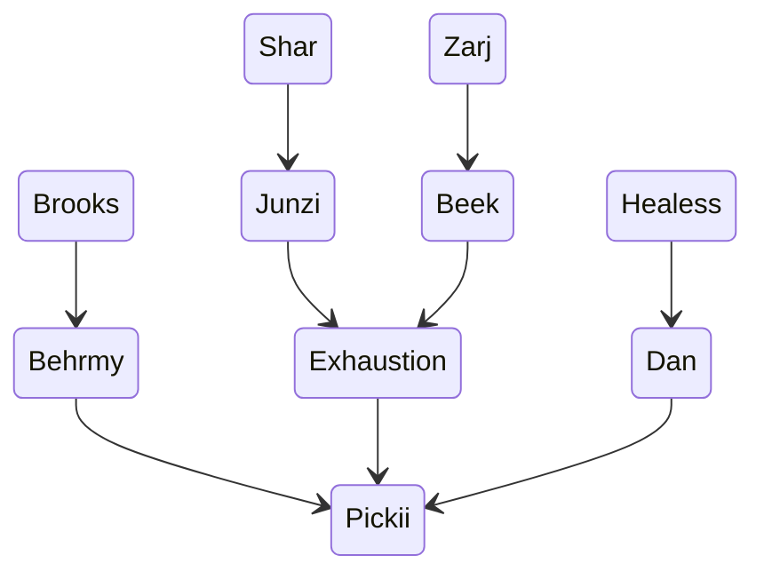

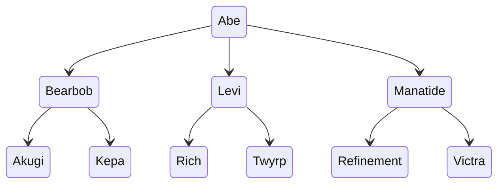

:fire: Attention :fire:
- Refinement positions totems towards mid so Dan can get buffs.
- Replicate what we did last week. Big tank heal. Healers stick to their assignments. Run as soon as you get burn.

 
 

# Felmyst

| Group | Hero |
| ----------- | ----------- |
| DPS groups | Hero off cooldown after 2nd air phase |

| Group :x: | Group :small_red_triangle_down: | Group :large_orange_diamond: | Group :large_blue_circle: |
| ----------- | ----------- | ----------- | ----------- |
| Melee Group [G1]| Hunter Group [G2]| Mage Group [G4]| Warlock Group [G3]|
| Exhaustion | Healess | Manatide | Behrmy |
| | Rene | Bearbob | |
| | | | |

## Soulstone 

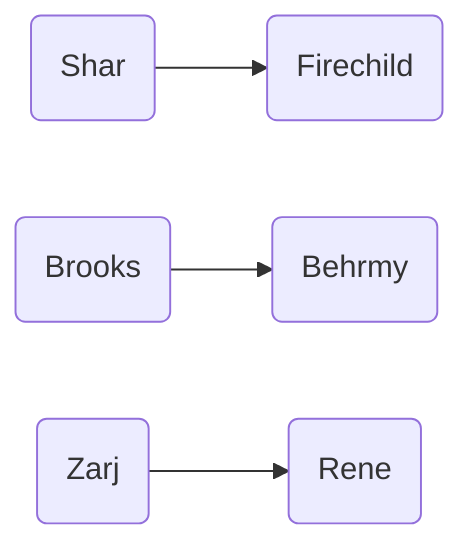

## DI

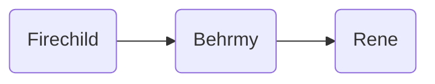

## Priest Brez 

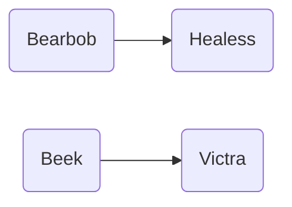

 
 

# Twins

 
 

# Muru

| Group | Hero |
| ----------- | ----------- |
| [G1] Melee | Hero after callout at the beginning |
| [G2] Hunter | Hero after callout at the beginning |
| [G3] Warlock | Hero after callout at the beginning |
| [G4] Mage | Hero after callout at the beginning |
| == Phase 2 == |
| [G2] Hunter | Manatide Hero after callout |
| [G3] Warlock | Exhaustion Hero after callout |

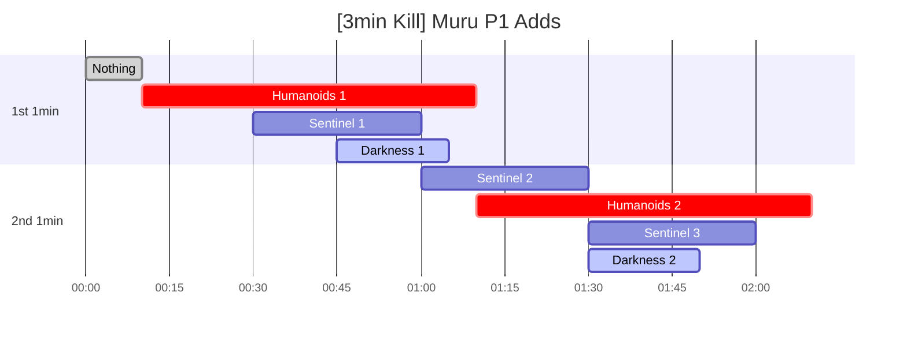

:fire: Attention :fire:
- Follow callouts and switch target **ASAP** :fire:
- P2 survive and pump :fire:

 
 

# KJ

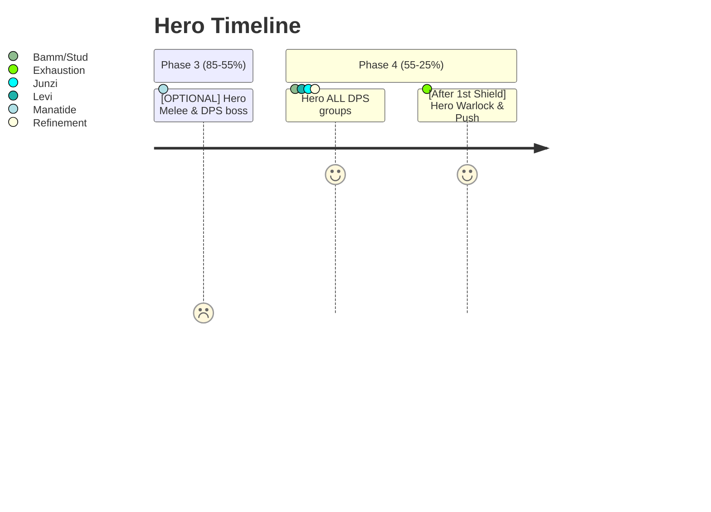

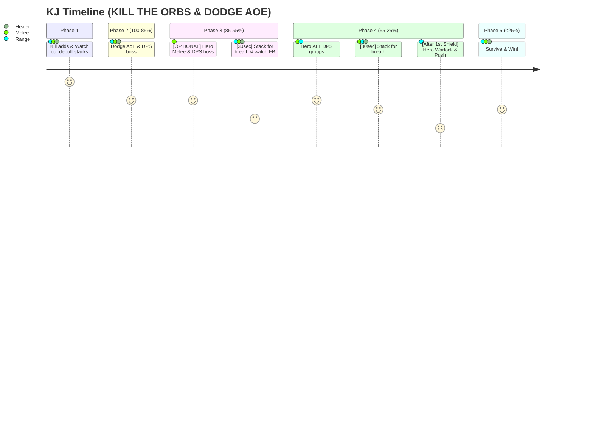
