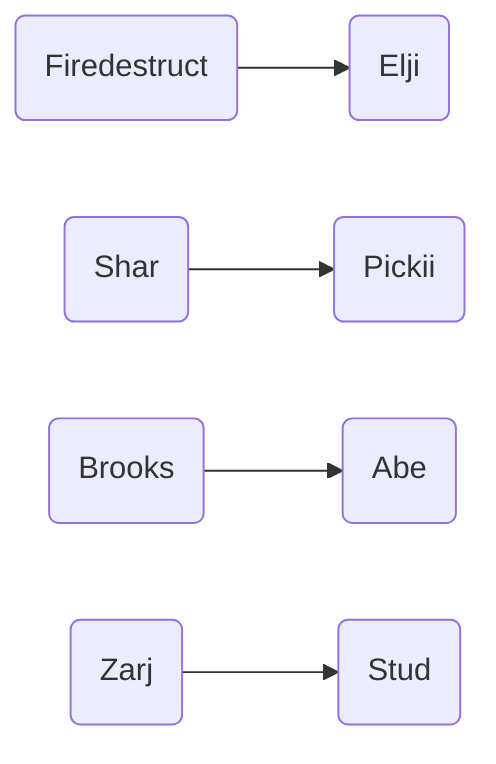
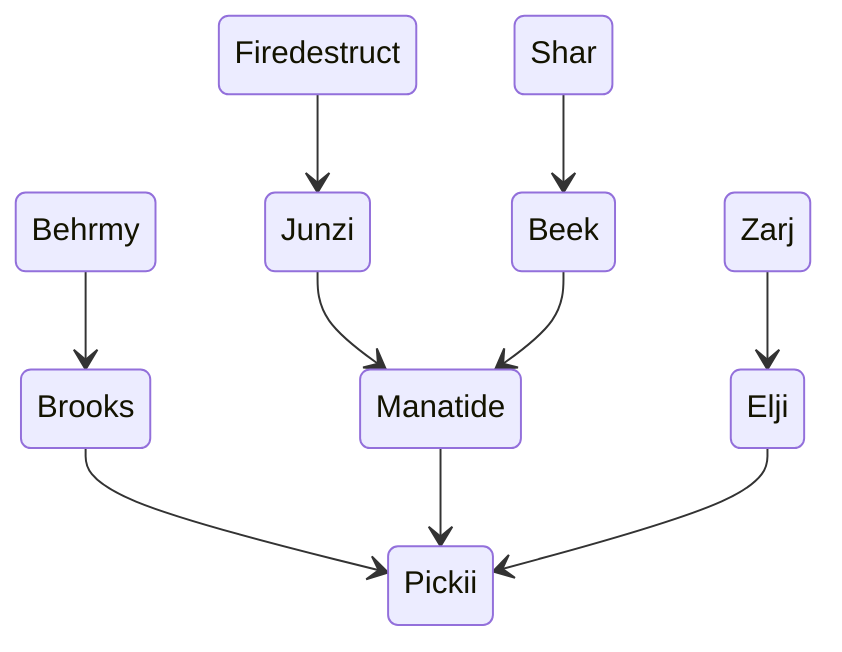
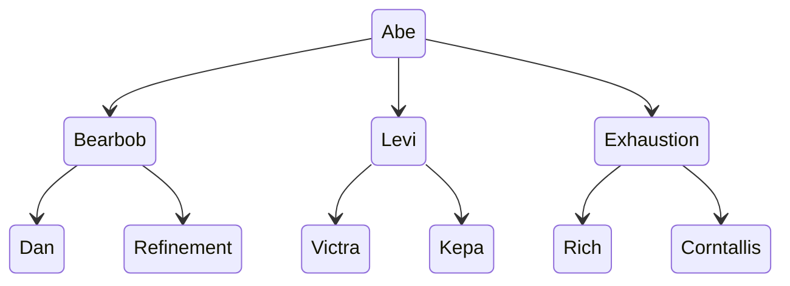
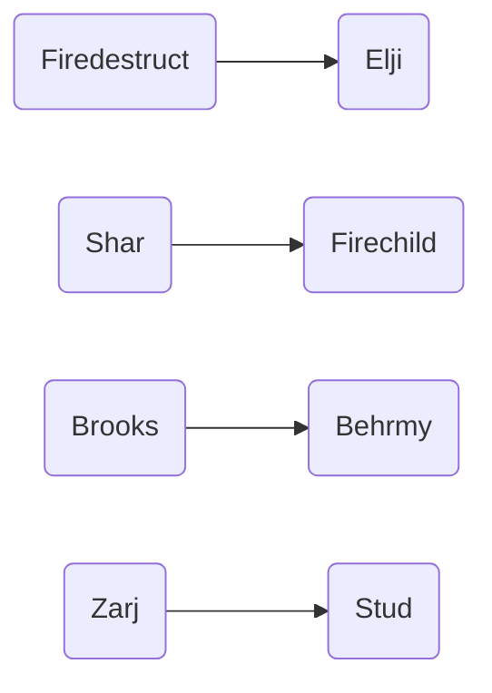
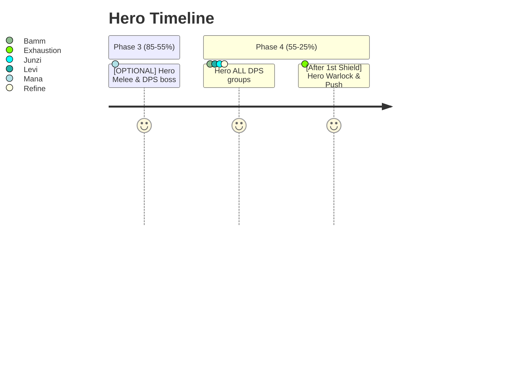

# Start

## Soulstone 

# Kalecgos

Click for healer assignment details

 
 

 
 

# Brutallus

Click for team bear details

Click for team warrior details

 
 

# Felmyst

| Group :x: | Group :small_red_triangle_down: | Group :large_orange_diamond: | Group :large_blue_circle: |
| ----------- | ----------- | ----------- | ----------- |
| Melee Group [G1]| Hunter Group [G2]| Mage Group [G4]| Warlock Group [G3]|
| Exhaustion | Elji | Manatide | Behrmy |
| | Stud | | Bearbob |
| | | | |

## Soulstone 

## Priest Brez 

 
 

# Twins

 
 

# Muru

 
 

# KJ

Click for hero timeline

